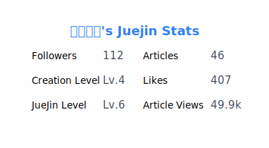

## Hi there 👋

Welcome to my Github

<!-- PR_STATS_START -->
## 🚀 我的开源贡献

> 总计在 8 个仓库中创建了 114 个 commits

<!-- PR_STATS_END -->

<table>
  <tr>
    <td></td>
    <td></td>
  </tr>
  <tr>
    <td></td>
  </tr>
</table>
